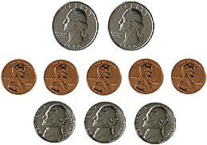

# Aula: Contagem de Objetos em Imagens com OpenCV

| Máscara                | Moedas                 |
|------------------------|------------------------|
|  |  |


## Descrição
Esta aula apresenta uma atividade prática de Processamento Digital de Imagens utilizando a biblioteca OpenCV em Python para contagem de objetos (moedas) em uma imagem.

O código realiza os seguintes passos principais:
1. Carregamento da imagem colorida.
2. Conversão para escala de cinza.
3. Binarização automática usando o método de Otsu.
4. Remoção de ruídos com operações morfológicas (abertura).
5. Inversão da máscara binarizada para destacar os objetos (moedas).
6. Detecção dos contornos dos objetos.
7. Filtragem dos contornos por área mínima para eliminar ruídos.
8. Desenho dos contornos na imagem original.
9. Exibição da máscara e da imagem resultante com contornos desenhados.
10. Impressão do número total de objetos detectados.

---

## Objetivos
- Entender o fluxo básico de segmentação e análise de imagens.
- Praticar técnicas de pré-processamento como binarização e operações morfológicas.
- Utilizar a função `findContours` para identificar objetos em imagens binárias.
- Aplicar filtros para considerar apenas objetos com área significativa.
- Visualizar resultados com `imshow` e manipular janelas OpenCV.

---

## Melhorias Implementadas

O código deste projeto apresenta diversas melhorias em relação ao exemplo básico de contagem de objetos:

- **Pré-processamento avançado:** Uso de CLAHE para realce de contraste, filtro bilateral e mediana para preservar bordas e remover ruídos.
- **Múltiplos métodos de binarização:** Combinação de Otsu, thresholds adaptativos, Triangle e threshold manual para melhor segmentação de diferentes tipos de objetos.
- **Limpeza morfológica suave:** Operações morfológicas com kernels pequenos para preservar objetos pequenos e preencher buracos.
- **Separação de objetos grudados:** Aplicação do algoritmo Watershed aprimorado para separar objetos que estão encostados.
- **Detecção complementar:** Combinação de detecção de bordas (Canny) e máscaras invertidas para capturar objetos difíceis.
- **Filtros de contorno dinâmicos:** Critérios relaxados e dinâmicos para não perder objetos válidos, ajustando área mínima conforme a imagem.
- **Visualização aprimorada:** Desenho de contornos coloridos, numeração dos objetos e exibição de resultados intermediários (opcional).
- **Processamento em lote:** Suporte para processar todas as imagens da pasta `images/` automaticamente.
- **Tratamento de erros:** Mensagens detalhadas e tratamento de exceções para facilitar o uso.

## Como Executar

1. Instale as dependências:
```bash
pip install -r requirements.txt
```
Ou, se preferir instalar manualmente:
```bash
pip install opencv-python numpy matplotlib scikit-learn
```

2. Coloque as imagens que deseja processar na pasta `images/`.

3. Execute o script principal:
```bash
python main.py
```

4. Os resultados serão salvos na pasta `images/` com prefixo `resultado_otimizado_` e as máscaras com prefixo `mask_`. As imagens processadas também serão exibidas na tela.

## Requisitos
- Python 3.x
- OpenCV (`opencv-python`)
- NumPy
- Matplotlib
- scikit-learn

Instalação:
```bash
pip install opencv-python
